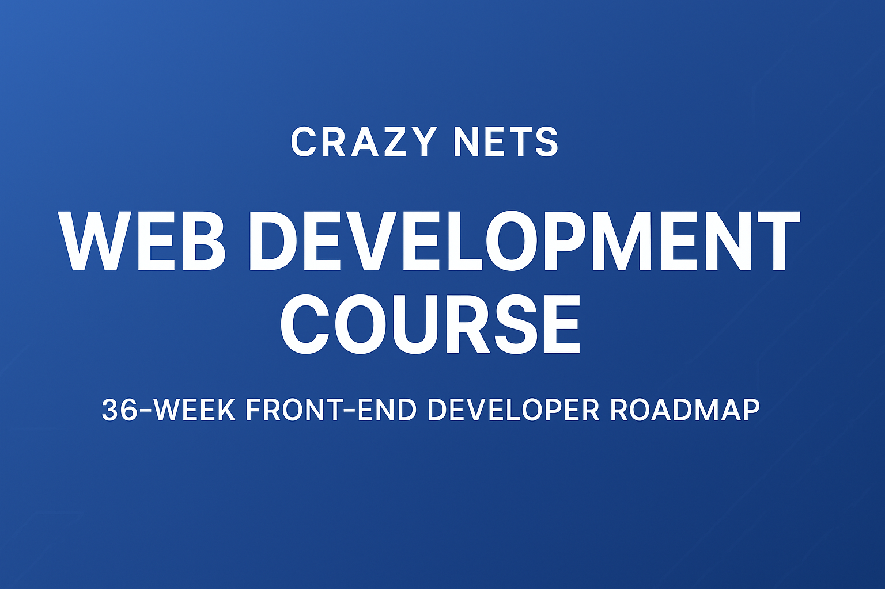

<p align="center">
  
</p>

# 🌐 Crazy Nets Web Development Course

Welcome to the **Crazy Nets Web Development Course** — a 36-week, hands-on journey designed to transform complete beginners into confident front-end web developers.

Through this course, you’ll learn to design, build, and deploy professional websites and modern web applications using **HTML, CSS, JavaScript, React, Git, APIs,** and **Deployment tools**.

---

## 🧭 Course Overview
- 🕓 **Duration:** 36 Weeks
- 🧰 **Level:** Beginner → Intermediate
- 🧑‍💻 **Instructor / Brand:** Crazy Nets
- 🪪 **License:** MIT License

This course combines **theory, practice, and projects** to ensure every learner gains both conceptual understanding and real-world experience.
Each module contains weekly objectives, coding exercises, and mini-projects to reinforce skills.

---

## 🚀 Getting Started
```bash
git clone https://github.com/your-username/crazy-nets-webdev-course.git
cd crazy-nets-webdev-course/modules
```
Each module includes a `README.md` file with weekly lessons, practice exercises, and project briefs.

---

## 🧱 Course Modules
| # | Module | Description |
|---|---------|-------------|
| 1️⃣ | **HTML Fundamentals** | Learn the building blocks of web pages — tags, structure, links, images, and forms. |
| 2️⃣ | **CSS Styling & Layouts** | Master styling, colors, typography, Flexbox, and Grid. |
| 3️⃣ | **JavaScript Programming** | Make your pages dynamic with variables, loops, functions, and DOM manipulation. |
| 4️⃣ | **ReactJS Framework** | Build interactive UIs with components, props, state, and hooks. |
| 5️⃣ | **Git & Version Control** | Learn version tracking, branching, and collaboration on GitHub. |
| 6️⃣ | **APIs & JSON** | Fetch and use data from external sources in your apps. |
| 7️⃣ | **Deployment & Hosting** | Take your projects live with Netlify, Vercel, and GitHub Pages. |

---

> _“Empowering tomorrow’s developers — one line of code at a time.”_  
> **— Crazy Nets**

